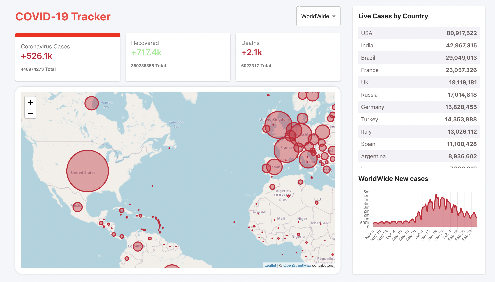

# covid19-tracker-app
https://covid19-tracker-app-9b77f.web.app/

## Intro
- An application to track the covid cases worldwide interactively.
- Used 'disease.sh - Open Disease Data API' for the covid cases data.
- Used technology are React JS, Material UI, Firebase. 

## Development Procedure

1. Create Wireframe (Sketching the what the visual looks like). - Using draw.io
2. Create React App 
3. Cleanup Project
4. Structure of COVID Tracker (Structuring the containers)
5. Creating Headers
6. Creating Info Boxes
7. Create Table
8. Create Chart
9. Create Map
10. Styling
11. Deploy

